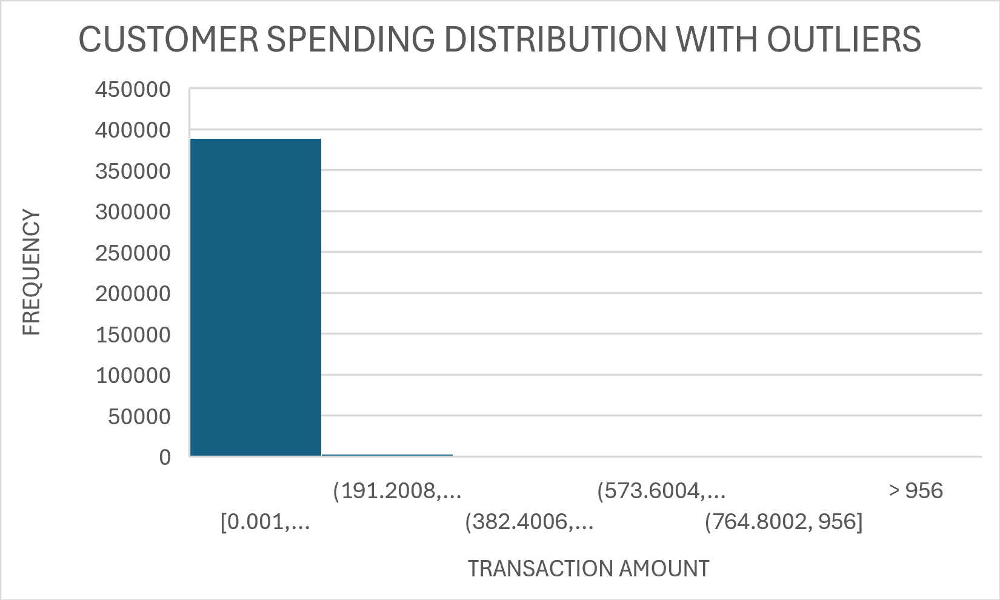
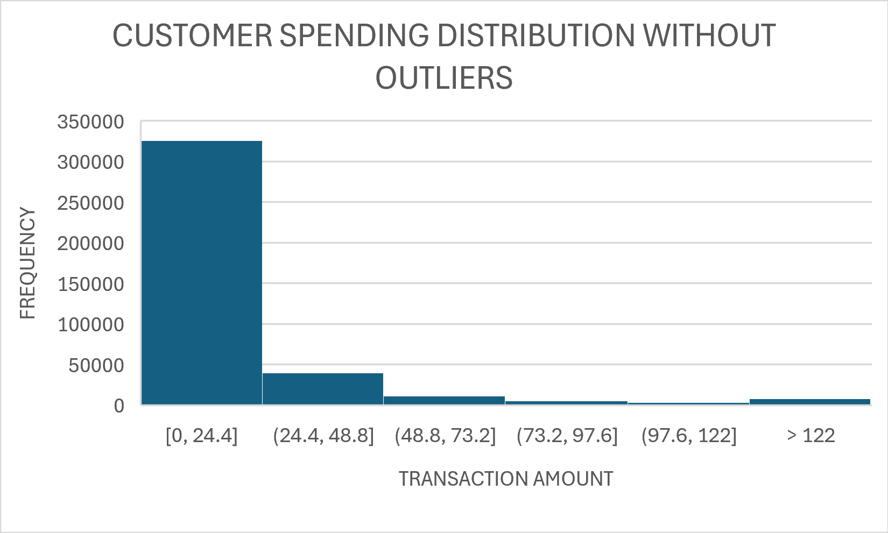

# Customer-Spending-Distribution-Analysis
Customer spending distribution and anomaly detection using Excel, SQL and Python.
# Customer Spending Distribution and Anomaly Detection

## Project Overview
This project analyzes customer spending behavior using statistical techniques and AI-based anomaly detection.

## Tools Used
- Excel
- SQL (PostgreSQL)
- Python
- Pandas
- Matplotlib
- SciPy
- Scikit-Learn
##Excel Histogram(With outliers)

##Excel Histogram (Without outliers)

## Analysis Performed
- Data Cleaning
- Missing Value Treatment
- Duplicate Removal
- Transaction Amount Calculation
- Mean
- Standard Deviation
- Histogram
- Box Plot
- Z-Score Analysis
- Outlier Detection
- Isolation Forest AI Anomaly Detection

## Key Findings
- Total Transactions: 392,692
- Z-Score Outliers: 342
- AI Outliers: 344
- Maximum Transaction: 168,469.60

## Project Structure
- Excel Analysis
- SQL Analysis
- Python Analysis
- AI-Based Anomaly Detection
